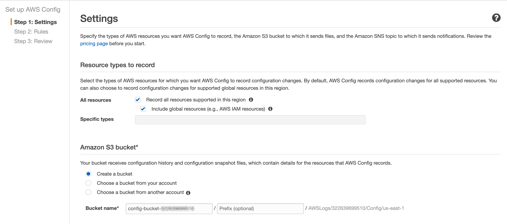
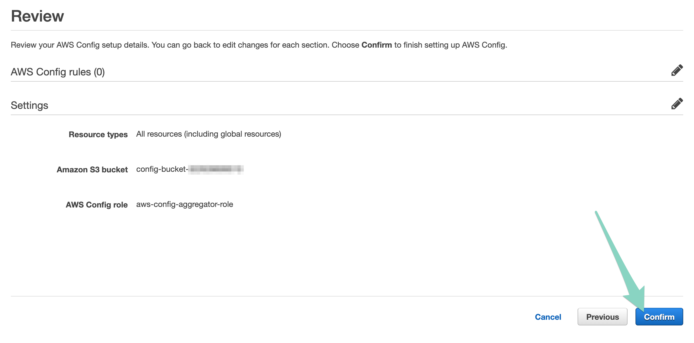
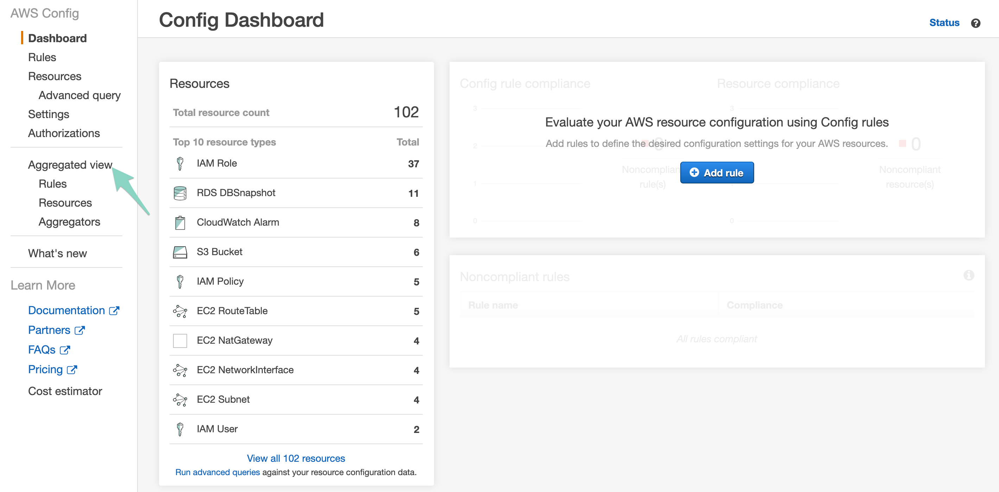

# VPC Eradicator! 💣

Tired of costly AWS bills because you forgot to delete a VPC once you were done with it? Hate going region by region in the AWS Console looking for every last resource? The VPC Eradicator 💣 is here to help!

### Benefits:
##### 💥 Keep at least a little of your money out of Jeff Bezos' pockets
##### 💥 Stop clogging your AWS account with dead resources
##### 💥 Replace `'AWS::EC2::VPC'` in the function code with whatever resources you'd like to periodically eradicate
##### 💥 Your CTO will love you!

### Risks:
##### 💀 You'll save so much money, you'll be tempted to gamble it all when in Vegas for re:Invent, and will be savagely killed by the mob when you 10x your debts
##### 💀 If your beverage of choice is tequila, you may want want to skip the 'Grab a beverage' instruction now and then (though that might make the AWS Console sections more bearable, so just go for it)

_No rewards with out the risks, amiright?_

## 1. Setup

### Best way: Deploy with Stackery

Use the [Stackery CLI](https://docs.stackery.io/docs/using-stackery/cli/) to create and deploy your serverless stack. After all, I created this app in Stackery and it made all the AWS permissions wrangling a breeze!

1. In your terminal, enter:

```bash
stackery create -n vpc-eradicator -p github --github-org <your github username> --blueprint-git-url https://github.com/bildungsroman/aws-vpc-eradicator/
```

2. Once your stack is created, deploy it to your AWS account:

```bash
stackery deploy -n vpc-eradicator -e <your enviornment name> -r master --aws-profile <your AWS account profile>

# Example:
# stackery deploy -n vpc-eradicator -e dev -r master --aws-profile dev-account
```

3. Grab a beverage as your stack deploys to CloudFormation

### Acceptable way: Deploy with the AWS SAM CLI

1. Clone this repo
2. In the root of the repo, enter:

```bash
sam deploy --template-file template.yaml --stack-name vpc-eradicator --profile <your AWS account profile> --region <the AWS region to deploy to>

# Example:
# sam deploy --template-file template.yaml --stack-name vpc-eradicator --profile dev-account --region us-west-2
```

3. Grab a beverage as your stack deploys to CloudFormation

### Worst way: Add stack and deploy in the AWS Console

...just, don't.

## 2. Add AWS Config

Alas, there's no avoiding the AWS Console on this one. You will need to create an AWS Config account and an Aggregated View role. Luckily, this only needs to be done once.

1. Navigate to [AWS Config](https://us-west-2.console.aws.amazon.com/config/home) in the AWS Console
2. Click `Get started` and follow the prompts - it'll look something like this:



3. You can skip the Config rules section, as that's not relevant here
4. Review and click `Confirm`



5. Grab another beverage. It'll take some time, but you should slowly see your Config Dashboard populate like so:



6. Once all that looks good, click `Aggregated view`, then `Aggregators` in the sidebar
7. Click `Add aggregator`
8. Follow the prompts to give it a name (like `vpc-eradicator`) and choose the account that houses your pesky VPC resources (or whatever resource you want to eradicate)
9. Select all regions!
10. Click `Save` at the bottom
11. You know what, just keep a refill for your beverage close, as this will definitely take a while
12. You'll be ready to go when there's no longer an annoying warning banner in your `Aggregated view` dashboard

## 3. Testing

Testing is easy with Stackery's `local invoke` command!

1. Clone your `vpc-eradicator` repo to your local machine
2. `cd` to the function directory of the repo (typically `cd vpc-eradicator/src/eradicateVPC`)
3. Run

   ```bash
   stackery local invoke --env-name <your deployed enviornment name> --aws-profile <the profile for the AWS account your stack is deployed to>

   # Example:
   # stackery local invoke --env-name dev --aws-profile dev-account
   ```
4. You should see something like this in the console if all goes well:

```bash

```

If for some reason you don't use [Stackery](https://www.stackery.io/), you can invoke your deployed function using the AWS CLI's `invoke` command:

```bash
aws lambda invoke --function-name vpc-eradicator-dev-eradicateVPC output.log
```

The output should return something like:

```bash

```

Sweet!